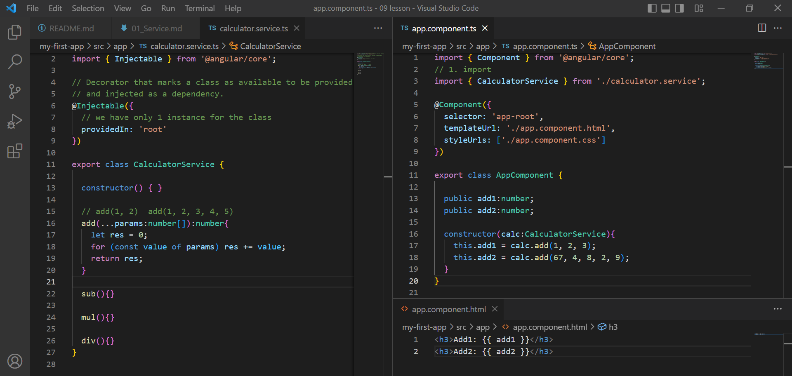

# Service - global data

> Service is similar to `redux` in react. (service is built-in for angular, while redux is an external JS library). 

* Service is a file with global data - available to the entire app. 
* Service can be any value, function, class or other feature. 

* Usually - service is a class, With a very specific purpose. 

* Injectable service class - global tasks available to all the components.

(inject = להזריק)

## DI (Dependency Injection)

Components use services. We inject a service into a component so we can use the data in it. 

* To define a class as a service - we add the `@Injectable` decorator - with metadata. 
* `providedIn:'root'` - There is only 1 instaance of the service shared across the app. 0

```ts
@Injectable({
  providedIn: 'root'
})
```

## Why use services?

* To share the same data in many components
* To handle the features that are diefferent from components. For example: CRUD/HTTP request, Authentication. 
* Reusable code - to organize the app better. (avoid code repetation). 

## Example:



1. Add a new service:
```
ng generate service calculator
//or
ng g s calculator
```

2. 2 files are created. (we can remove spec for now - for testing)
```
CREATE src/app/calculator.service.spec.ts (377 bytes)
CREATE src/app/calculator.service.ts (139 bytes)
```

#### calculator.service.ts
```ts
//  Injectable is an interface - metadata about the service
import { Injectable } from '@angular/core';

// Decorator that marks a class as available to be provided and injected as a dependency.
@Injectable({
  // One instance of the service shared across the app
  // If one component changes the data in service - everything is updated
  // in the entire app
  providedIn: 'root'
})

export class CalculatorService {

  constructor() { }

  public myName = 'Alex';

  // add(1, 2, 3), add(2, 3), add(5 ,6 ,7 4)
  add(...params:number[]):number{
    let res = 0;
    for (const value of params) res += value;
    return res;
  }

  sub(){}

  mul(){}

  div(){}
}
```

#### app.components.ts
```ts
import { Component } from '@angular/core';
// 1. Import
import { CalculatorService } from './calculator.service';

@Component({
  selector: 'app-root',
  templateUrl: './app.component.html',
  styleUrls: ['./app.component.css']
})

export class AppComponent {

  sumAdd1:number;
  sumAdd2:number;

  constructor(calc: CalculatorService){
    this.sumAdd1 = calc.add(1, 2, 3, 4);
    this.sumAdd2 = calc.add(1, 2);
  }

}
```


